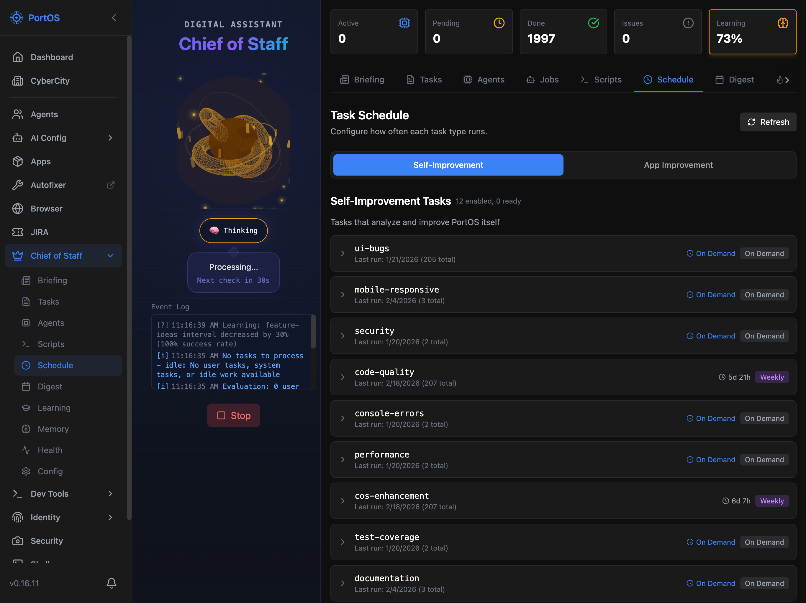

# PortOS

A self-hosted operating system for your dev machine. Manage apps, orchestrate AI agents, build your digital twin, and capture knowledge — all from a single dashboard accessible anywhere via [Tailscale](https://tailscale.com).

Think Umbrel, but for your active git repos, AI workflows, and personal knowledge. Access everything from your phone, tablet, or any device on your Tailscale network.



## Core Features

### App Management
- **Dashboard** — Grid of app tiles with real-time status, port links, start/stop/restart controls, and system health monitoring
- **Smart Import** — Point to a directory and auto-detect project config from package.json, vite.config, and ecosystem.config
- **App Templates** — Scaffold new projects from pre-built templates with AI provider integration
- **Real-time Logs** — Stream PM2 logs via Socket.IO with tail length control
- **JIRA Integration** — Per-app board config, active sprint resolution, epic search, and ticket creation from the UI

### Chief of Staff (CoS)
An autonomous AI agent orchestrator that manages your development workflow:

- **Task Scheduling** — Submit tasks, set priorities, and let CoS dispatch AI agents (Claude Code, Codex, Gemini CLI, Ollama, LM Studio) to complete them
- **Multi-Agent Orchestration** — Run multiple agents concurrently with global and per-project limits, capacity management, and fair scheduling
- **Task Learning** — Tracks success rates, error patterns, and model performance to dynamically route tasks to the best provider
- **Goal Tracking** — Define goals and track progress across hundreds of completed tasks with success rate metrics
- **Scheduled Automation** — Cron-based self-improvement and app-improvement jobs with per-app interval overrides
- **Decision Transparency** — Every skip, switch, and routing decision is logged with reasons, surfaced on the dashboard
- **Productivity Analytics** — Work streaks, hourly/daily patterns, milestones, and AI-generated insights
- **Weekly Digest** — Visual summaries of accomplishments, learnings, and week-over-week comparisons
- **Error Recovery** — Automatic diagnosis and retry with adjusted routing for failed tasks

### Digital Twin
An identity scaffolding system for building an AI representation of yourself:

- **Identity Documents** — Manage markdown documents organized by category (values, communication style, routines, expertise, etc.)
- **Behavioral Testing** — Run alignment tests across 14 dimensions with multi-model comparison
- **Enrichment Questionnaire** — Guided questions across 14 categories to deepen the identity model
- **Taste Profiling** — Likert-scale preference scoring with moving averages across personality dimensions
- **Writing Style Analysis** — Extract voice patterns and communication style from writing samples
- **Contradiction Detection** — AI analysis flags inconsistencies across identity documents
- **Genome Visualization** — Genetic trait markers, cancer risk categories, and health predispositions (100+ SNP markers)
- **Import/Export** — Import from Spotify and other sources; export as system prompt, CLAUDE.md, JSON, or individual files
- **Creation Wizard** — 5-step guided setup for building a new digital twin from scratch

### Brain (Second Brain)
A thought capture and knowledge management system:

- **Thought Capture** — Natural language input with AI-powered auto-classification into People, Projects, Ideas, and Admin
- **Inbox Review** — Validate and correct AI classifications before they're filed
- **Knowledge Links** — Build a graph of connections between thoughts, people, and projects
- **Memory System** — Long-term memory storage with vector similarity search, BM25 retrieval, and consolidation
- **Daily/Weekly Digest** — AI-curated summaries of captured knowledge
- **Trust Scoring** — Rate data source reliability for better knowledge hygiene

### Developer Tools
- **Web Shell** — Full terminal emulator in the browser (xterm.js + node-pty) with Ghostty theme support
- **AI Runner** — Execute prompts across any configured provider directly from the UI
- **Process Monitor** — View all PM2 processes with live memory, CPU, uptime, and restart controls
- **Agent Tracker** — Monitor running AI agents with runtime stats, app badges, and JIRA ticket links
- **Git Management** — Branch status, release workflows, and PR creation
- **Action History** — Searchable log of all executed actions with filtering and statistics
- **CyberCity** — 3D voxel city visualization of your apps and agents in real-time
- **Browser Control** — Remote Chrome DevTools Protocol integration for headless browser management

### Infrastructure
- **Mobile Ready** — Responsive design with collapsible sidebar for on-the-go access
- **Multi-Provider AI** — Configure Claude, OpenAI, Gemini, Ollama, LM Studio, and more with model tiers and fallback chains
- **Secret Management** — Environment variable masking, API key redaction, and PTY shell allowlisting
- **File Uploads** — Drag-and-drop file storage with preview support

## Quick Start

```bash
git clone https://github.com/atomantic/PortOS.git
cd PortOS
./setup.sh
pm2 start ecosystem.config.cjs
pm2 save
```

Access PortOS at http://localhost:5554 (or via Tailscale at http://[your-machine]:5554). PM2 keeps PortOS running in the background and auto-restarts on reboot (with `pm2 save` + `pm2 startup`).

## Network Access

PortOS binds to `0.0.0.0` so you can access it from any device on your Tailscale network:

- Manage apps running on your home dev machine from anywhere
- Check logs and restart services from your phone
- View dashboard on your tablet while coding on your laptop

> **Security Note**: PortOS is designed for private Tailscale networks. Do not expose ports 5554-5560 to the public internet.

## Project Structure

```
PortOS/
├── client/              # React + Vite frontend (port 5554)
├── server/              # Express.js API (port 5555)
├── data/                # Runtime data (apps, providers, history)
├── data.sample/         # Sample configurations to copy
├── docs/                # Documentation and screenshots
└── ecosystem.config.cjs # PM2 configuration
```

## Tech Stack

- **Frontend**: React 18, Vite, Tailwind CSS, Three.js, xterm.js
- **Backend**: Express.js, Socket.IO, PM2, Zod validation
- **Data**: JSON file persistence, vector embeddings for memory search
- **AI**: Claude Code, Codex, Gemini CLI, Ollama, LM Studio (via [portos-ai-toolkit](https://www.npmjs.com/package/portos-ai-toolkit))

## PM2 Commands

```bash
pm2 start ecosystem.config.cjs    # Start PortOS
pm2 status                         # View status
pm2 logs portos-server --lines 100 # View server logs
pm2 restart portos-server portos-ui # Restart processes
pm2 stop portos-server portos-ui   # Stop processes
pm2 save                           # Save process list (survives reboot)
```

## Configuration

### Apps (`data/apps.json`)
Each registered app includes:
- **name** — Display name in the dashboard
- **repoPath** — Absolute path to project directory
- **uiPort / apiPort** — Port numbers for quick access links
- **startCommands** — Commands to start the app (used by PM2)
- **pm2ProcessNames** — PM2 process identifiers for status tracking

### AI Providers (`data/providers.json`)
Configure AI providers for the runner and Chief of Staff:
- **CLI-based**: Claude Code, Codex, Gemini CLI
- **API-based**: OpenAI, Anthropic, Google (with model tier management)
- **Local models**: Ollama, LM Studio (OpenAI-compatible endpoints)

## Documentation

- [Architecture Overview](./docs/ARCHITECTURE.md) — System design and data flow
- [API Reference](./docs/API.md) — REST endpoints and WebSocket events
- [Contributing Guide](./docs/CONTRIBUTING.md) — Development setup and code guidelines
- [PM2 Configuration](./docs/PM2.md) — PM2 patterns and best practices
- [Port Allocation](./docs/PORTS.md) — Port conventions and allocation guide
- [Versioning & Releases](./docs/VERSIONING.md) — Version format and release process
- [GitHub Actions](./docs/GITHUB_ACTIONS.md) — CI/CD workflow patterns
- [Troubleshooting](./docs/TROUBLESHOOTING.md) — Common issues and solutions

## License

MIT
