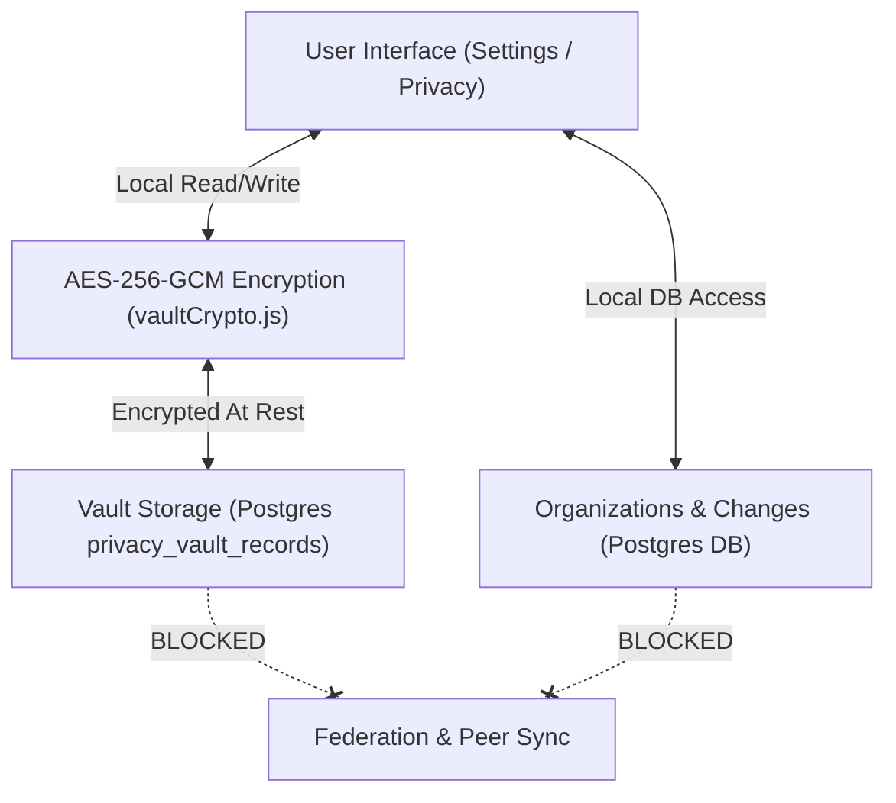

# Privacy Center

The Privacy Center is the PII (Personally Identifiable Information) management subsystem of PortOS. While the Digital Twin models aesthetic tastes, writing style, chronotype, and goals for AI prompts, the Privacy Center handles Sensitive Identity Data and Personal Records that must be protected, machine-local, and explicitly isolated.

> [!IMPORTANT]
> **Privacy Boundary Contract**: Per ADR [privacy records machine-local](../decisions/2026-08-08-privacy-records-machine-local.md), records stored within the Privacy Center are strictly machine-local. They **NEVER** ride the federation layer, sync buckets, or peer-to-peer share networks, and are never included in LLM prompt contexts unless explicitly requested by the user.

---

## Subsystems

### 1. Vault
The **Vault** is an encrypted, machine-local key-value store for sensitive personal documents and numbers:
- Government identification (Passport numbers, SSN / Tax ID, Driver's license)
- Financial identity (Bank account references, tax entity IDs)
- Emergency contacts & private physical addresses

Data in the Vault is stored encrypted at rest (`server/lib/vaultCrypto.js`) using machine-derived key material and requires standard authentication when auth is enabled.

### 2. Organizations
The **Organizations** registry maintains a list of third-party companies, services, and institutions that hold your personal data (e.g. financial institutions, utility providers, subscription services, medical providers). Each entry tracks:
- Account references and data categories held
- Contact channels and privacy policy links
- Data retention & deletion policies

### 3. Changes Inventory
When changing physical addresses, phone numbers, legal names, or primary emails, the **Changes** workflow provides a checklist and tracking matrix:
- Inventory of organizations requiring update
- Notification status per organization (pending, requested, confirmed)
- Verification notes and dates updated

### 4. Data Brokers
The **Data Brokers** module tracks exposure on data brokers, people-search sites, and marketing list aggregators. It manages:
- Opt-out & CCPA / GDPR deletion request tracking
- Direct opt-out URL shortcuts and template letters
- Status verification dates and follow-up reminders

**Consent is per purpose and revocable.** Each household subject holds separate grants (Household drawer), and the scan/opt-out engines refuse — on direct calls and on the automatic recheck schedule alike — without an active grant of the exact purpose:

| Scope | Unlocks | Leaves this machine |
|---|---|---|
| `pii_vault` | Local encrypted vault storage (granted at subject creation) | Nothing |
| `broker_scan` | The read-only exposure scan | Scan-eligible name and city/state, in broker search URLs |
| `broker_optout` | Opt-out submissions and their verification re-probes | Full name, email, phone, city/state (and DOB when a broker requires it) |

A vault grant never implies a broker purpose, and a scan grant never implies submissions. Revoking a broker purpose stamps `revoked_at` on its grant rows — the subject, their vault records, and the audit trail stay — so even the undeletable `self` subject can withdraw it.

---

## Security Model & Data Flow

1. **Isolation**: No endpoint under `/api/privacy/*` or `/data/vault*` participates in peer sync or cloud-folder share buckets (`data/sharing/`).
2. **Prompt Injection Safety**: Privacy Center records are omitted from default RAG indices (BM25 & pgvector) used by AI agents and Chief of Staff tasks.
3. **Auditability**: All modifications to Vault entries produce localized JSON audit entries without logging raw payload values.
