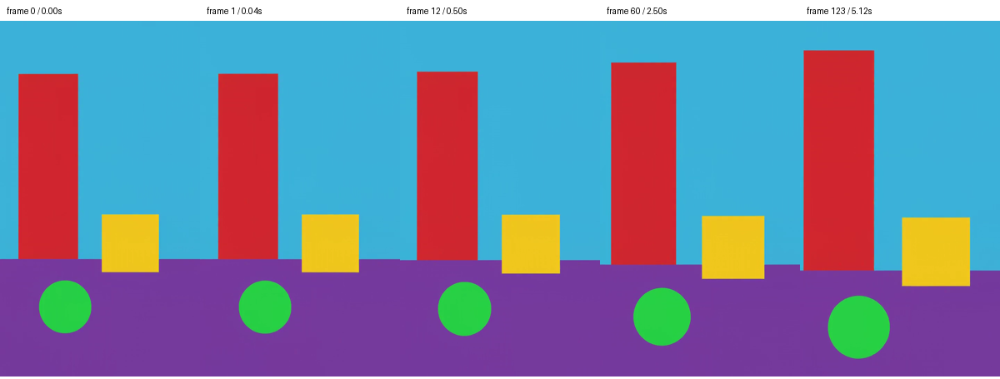
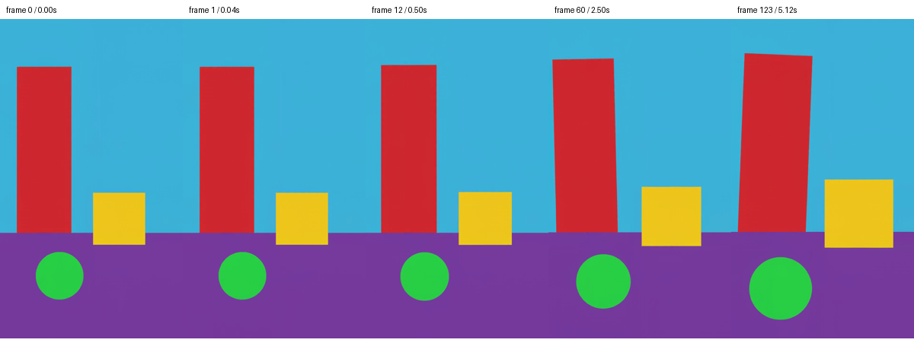
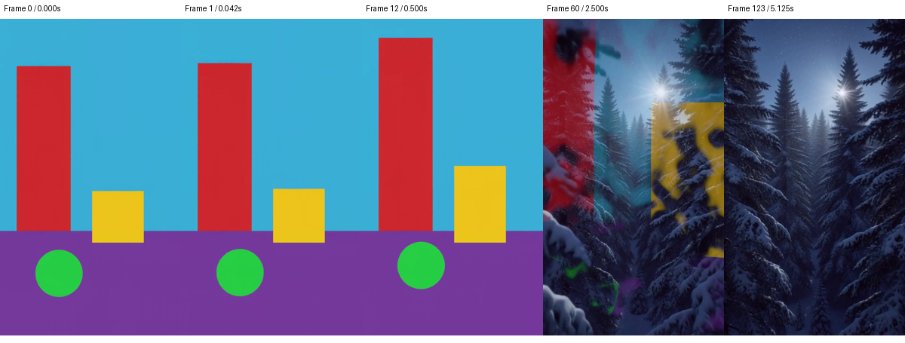
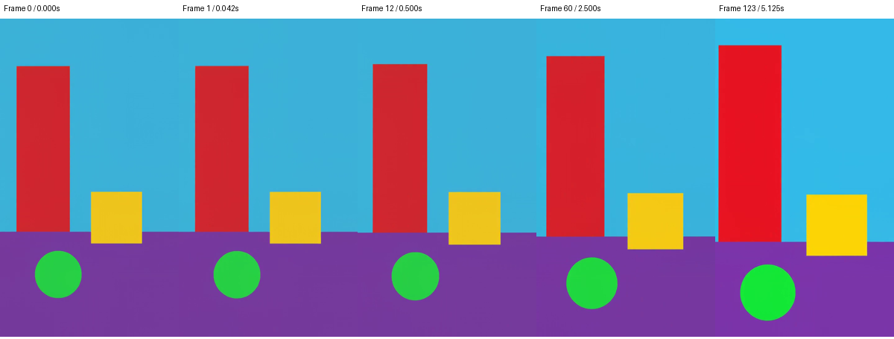
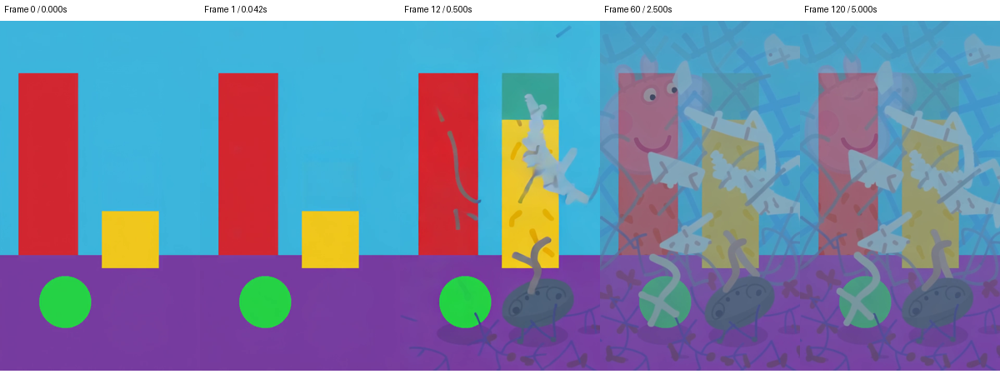

# MiniMax H3 scene-continuity comparison

Controlled validation for #8867 found that H3 preserves the tested synthetic
scene with a motion-only prompt at both canvases, while a conflicting prompt
replaces it. The geometry correction follows the reference contract but does
not explain this fixture's continuity: both before and after preserve it.
LTX adds substantial new content even with the motion-only prompt. These are
bounded observations, not a claim that the original private-image failure is
fixed. Production vision-precision differences remain tracked in #8948.

Native image-mode canvas selection landed in commits `95b864cd1` and
`1aba4b504`; it removes a confounding factor without guaranteeing continuity.

## Controlled H3 runs

`scripts/diagnose_minimax_h3.py` creates a synthetic colored room with a doorway,
cube and ball, then compares three fixed-seed, stock-encoder, no-LoRA requests:

| Case | Canvas | Prompt |
| --- | --- | --- |
| small-motion | 576×1024 | Camera moves forward; objects remain stationary |
| native-motion | 768×1344 | Same motion-only prompt |
| native-conflict | 768×1344 | Camera moves through a snowy forest |

All use 124 frames, 24 fps, seed 42 and 9 sigma entries. The script pins the
runtime and checkpoints used by the original report so registry updates do not
silently change the experiment. It calls the production adapter, including its
vision-weight, image-processor and vision-embedding corrections. It never pastes
the source over generated frames or changes conditioning tensors.

Use a **new directory outside the checkout** for each invocation. Planning needs
only Python's standard library and does not import MLX or load models:

```sh
python3 scripts/diagnose_minimax_h3.py --output-dir /tmp/h3-continuity-plan
```

Inspect `source.ppm` and `plan.json`. To render, ensure no other GPU work is
running, then use the already installed H3 interpreter and another new directory:

```sh
~/.portos/minimax-h3-mlx/.venv/bin/python3 scripts/diagnose_minimax_h3.py \
  --output-dir /tmp/h3-continuity-render --run
```

This command is expensive: the pinned runtime reports approximately 8.8 minutes
per native five-second diffusion step on its reference hardware. Three runs can
take several hours. Each render uses a separate process, runs sequentially and
stops the comparison on failure. The script does not coordinate with PortOS's
live GPU queue; run it only while that queue and other GPU applications are idle.
Weights must already be cached; child processes enforce Hugging Face offline
mode. No model download, substitute encoder or preview decoder is requested.

Each case contains the video, frames 0/1/12/60/123, a local runtime log and
`report.json`. The report separates setup, conditioning/inference, video decode,
audio decode and mux wall time. It observes the patched text encoder's embedding
shape/tags, VAE conditioning rows and first DiT call's packed shapes/tags/index
counts. These are **structural observations, not numerical parity assertions**.
Lazy work may be charged to the boundary that materializes it. Failed worker
runs retain a failed report and log; never interpret partial outputs as success.
Logs may contain local paths; redact them before publishing evidence.

## Reference parity finding: vision input geometry

A static comparison of the pinned MLX port against the vendored FL2VA reference
(`reference/diffusers/modular/` in the runtime checkout) found one divergence
on the image path. The reference setup step replaces its keyframes with
canvas-prepared copies (`prepare_keyframe_image`: stretch the first keyframe,
cover-crop a follower), and **both** the Qwen3-VL text encoder and the video VAE
read those prepared images. The port prepares keyframes only inside
`_encode_keyframes`; its text encoder received the raw upload.

With the checkpoint's processor (patch 16, merge 2, up to 16.7M pixels) each
vision token covers 32×32 pixels, the same footprint as a VAE latent patch. A
canvas-prepared 576×1024 keyframe therefore yields an 18×32 vision grid that
matches the 18×32 conditioning rows. A raw 3024×4032 photo yields about 11,800
vision tokens, and a 1920×1080 frame roughly 2,000 tokens at the wrong aspect.
Both are unlike anything the reference presents.

`generate_minimax_h3.py` now places keyframes on the canvas before calling the
pipeline, using the port's own `prepare_keyframe_image`. That function returns
a canvas-sized image unchanged, so VAE conditioning is byte-for-byte what it was
before. The vision features now follow the reference contract. Prompt-embedding
cache keys follow the prepared pixels, so older raw-image entries age out.

This fixes a real integration defect, but it is **not a confirmed root cause**
of the scene change: the before/after render below preserves the scene in
both cases. The synthetic source from the diagnostic is already 768×1344,
so its native cases never took this path. VAE normalization/posterior sampling,
packed tags and rotary positions
matched the reference in structure and are covered by the runtime's own parity
tests. Another difference found was the image-processor backend,
examined next.

## Reference parity finding: image-processor backends

The reference encodes keyframes with the checkpoint-declared torchvision
`Qwen2VLImageProcessor`. The MLX runner has no PyTorch, so it binds that
processor's PIL twin, `Qwen2VLImageProcessorPil`. At the pinned transformers
5.14.1, the two share `smart_resize`, BICUBIC resampling, RGB conversion, the
checkpoint's configuration (patch 16, merge 2, temporal patch 2, 65,536 to
16,777,216 pixels, mean and std 0.5) and the patch flattening order. They differ
in two ways. The twin resamples through Pillow on `uint8` and normalizes as
`(x / 255 - 0.5) / 0.5`. The reference resamples with antialiased torchvision
bicubic and normalizes as a fused `(x - 127.5) / 127.5`. Both return float32
arrays with an identical `[1, h/16, w/16]` grid.

`scripts/diagnose_minimax_h3_processor.py` runs both backends on the CPU over
deterministic synthetic images. The images are half gradient and half full-band
noise, the worst case for a resampler. The script reads only the cached
checkpoint's `FL2VA/processor` directory and never loads a model. Run it with
an existing interpreter that has transformers at the H3 lock's version, torch
and torchvision. The H3 venv has no torch, so it cannot run this check.

```sh
<python-with-torch> scripts/diagnose_minimax_h3_processor.py \
  --processor-dir <hf-cache>/models--MiniMaxAI--MiniMax-H3/snapshots/<revision>/FL2VA/processor
```

A run at transformers 5.14.1, torch 2.13 and torchvision 0.28, against checkpoint
revision `6818f6c3`, produced:

| Input (w×h) | Processor resamples | Max abs diff | bfloat16 mismatch |
| --- | --- | --- | --- |
| 576×1024, 768×1344, 1344×768, 512×288 (canvases) | no | 5.9e-8 | 0 |
| 1080×1920, 720×1280 (raw frames) | yes | 1/127.5 (one 8-bit level) | 0.1–0.2% |
| 128×256 (below the pixel floor) | yes | 2/127.5 | 10.7% |

Every H3 canvas is a multiple of 32, which is the processor's resize factor.
Canvases at H3's released sizes are also well inside its pixel bounds. After
the runner places keyframes on the canvas, the processor therefore never
resamples them. The twin's output then matches the reference to float32
rounding. After the port casts it to the vision tower's bfloat16, it is
bit-identical. The backend difference is real only for inputs the processor
resamples: raw uploads before the vision-geometry correction, or a custom canvas
smaller than 65,536 pixels. In this run that gap was at most two 8-bit levels,
and the reference resamples those inputs too. The PIL twin is **excluded as a cause** of the scene
change on the production path. No correction is warranted. The script exits
nonzero if a future transformers pin breaks this parity on a canvas.

The continuity harness now records the backend class and keyframe input sizes as
`vision_processor` in each `report.json`. A render can then show which processor
read its keyframes and whether they arrived canvas-sized.

## Hardware validation on 2026-09-27

The controlled motion-only cases now have real renders on Apple M5 Max hardware
with 128 GiB unified memory, using the pinned runtime and checkpoints above.
The PortOS runner source was commit `585330fba8724f11daf6d5ea26876987ce7a9e0c`;
the relevant H3/LTX runners remained unchanged on the final synchronized base.
The production adapter was used without a substitute encoder, LoRA, preview
VAE, or source-frame compositing. Both cases preserve the synthetic scene in
frames 0, 1, 12, 60 and 123 (the last sample is at 5.125 seconds).

| Case | Setup | Conditioning + inference | Video decode | Audio decode | Mux | Total |
| --- | ---: | ---: | ---: | ---: | ---: | ---: |
| 576×1024 motion-only | 30.1 s | 900.9 s | 100.0 s | 4.2 s | 1.2 s | 1036.4 s |
| 768×1344 motion-only | 23.2 s | 1800.1 s | 136.4 s | 1.9 s | 4.4 s | 1966.1 s |
| 768×1344 conflicting prompt | 25.2 s | 1936.5 s | 135.1 s | 1.5 s | 1.8 s | 2100.1 s |
| 576×1024 motion-only, before geometry correction | 21.9 s | 803.5 s | 87.3 s | 3.5 s | 2.2 s | 918.6 s |

These are observed diagnostic wall times, not isolated performance benchmarks.
No competing GPU process was detected. CPU-only numerical reference checks
ran alongside the smaller case, and a brief rotary-index check overlapped the
native case. A short CPU vision-diagnostic reproduction check overlapped the
before-correction run. An earlier attempt was stopped after its API-based exclusivity
monitor timed out; it produced no clip and is excluded from this table. The
successful sequence used a local process monitor instead.

The smaller case had 576 VAE conditioning rows, 594 prompt/vision rows and
22,896 packed rows. The native case had 1,008 VAE conditioning rows, 1,026
prompt/vision rows and 39,744 packed rows. Both recorded canvas-sized keyframes
at the PIL image processor. Across all 124 decoded frames, FFmpeg's largest
adjacent-frame scene score was 0.002499 and 0.001892 respectively. Those scores
support the visual observation of gradual motion; they are not a general
semantic-continuity test.





The conflicting prompt preserves the colored scene at 0.5 seconds but replaces
it with snowy pine trees by 2.5 seconds; the final sample is a forest. Thus the
native canvas and valid image-conditioning rows do not prevent prompt-driven
scene replacement. This demonstrates a limitation on this synthetic input,
not the root cause or precise onset of the original private-image report.



### Before/after geometry correction

A separate 576×1024 run changed only the in-process
`place_keyframes_on_canvas` function to return the original images. The same
source, motion prompt, seed, weights and schedule were used. Its vision encoder
received 768×1344 pixels (1,026 prompt/vision rows), while the VAE still supplied
576 conditioning rows; the packed sequence had 23,328 rows. Thus the test
actually exercised the earlier geometry mismatch.

The colored scene persists in every sampled frame before and after the
correction. Motion differs, but neither clip changes environments. Keep the
correction because it follows the reference's geometry contract; do not call
it a demonstrated continuity fix. Reproduce this diagnostic in a fresh process
by importing `diagnose_minimax_h3` and `generate_minimax_h3` from `scripts`,
setting `generate_minimax_h3.place_keyframes_on_canvas = lambda images, width,
height: images`, then invoking the harness's `run_worker` for `small-motion`
in a fresh directory containing its synthetic `source.ppm`. This is a local
experiment override, never a production setting.



### Numerical conditioning observations

The actual cached vision and VAE encoder weights were compared on the same
576×1024 canvas-prepared synthetic keyframe, with transformers 5.14.1,
mlx-vlm 0.6.10, MLX 0.32.0 and PyTorch 2.12.0. The reference VAE and its weight
conversion came from the pinned runtime's vendored FL2VA reference. The CPU
float32 comparisons observed:

| Boundary | Maximum absolute difference | Relative RMS difference |
| --- | ---: | ---: |
| Merged vision features | 0.0014983 | 0.002024% |
| Three deepstack feature outputs | ≤0.0001834 | ≤0.001332% |
| VAE posterior mean | 0.0051966 | 0.006198% |
| VAE posterior log variance | 0.0007639 | 0.000949% |
| Sampled, float16-rounded, normalized latents with shared noise | 0.0030597 | 0.012928% |

The shared-noise comparison uses the same NumPy draw for both sets of moments;
it does **not** assert that MLX and PyTorch generate the same noise from seed 42.
Qwen3-VL image/text rotary positions and deltas matched exactly at both tested
canvases (594 and 1,026 tokens). The runtime's packing/scheduler parity checks
also passed against its vendored reference on CPU, including tags, indices,
rotary coordinates and the denoising schedule. These observations narrow the
investigation but do not prove parity of the full conditioning language model
or all production Metal arithmetic.

The Metal float32 VAE moments differ from the CPU reference by at most
0.0000914 (relative RMS 0.000068%). Vision arithmetic is more sensitive:

| Vision comparison | Merged features relative RMS difference | Largest deepstack relative RMS difference |
| --- | ---: | ---: |
| MLX Metal float32 versus PyTorch CPU float32 | 0.6910% | 0.4998% |
| MLX Metal bfloat16 versus PyTorch MPS bfloat16 | 13.4798% | 8.9639% |
| MLX Metal bfloat16 versus its float32 output | 15.6168% | 9.3885% |
| PyTorch MPS bfloat16 versus its CPU float32 output | 12.3286% | 7.5315% |

These are measured differences, **not a passing production-precision parity
claim**. The reference uses eager attention and the MLX implementation uses
fused attention. Both bfloat16 paths differ materially from float32; the test
does not isolate kernel, accumulation, interpolation or rounding effects, nor
show that the difference causes a scene change. No precision correction is
applied on this evidence alone.
The layer-level investigation is tracked in [#8948](https://github.com/atomantic/PortOS/issues/8948).

Reproduce vision outputs with `scripts/diagnose_minimax_h3_vision.py`, using
an interpreter containing the versions above plus torchvision 0.27.0 and
safetensors. Generate the synthetic PPM with the continuity harness first.
Each invocation loads only the actual vision weights, applies the production
MLX weight sanitizer, prepares the same 576×1024 canvas, and saves four arrays
(merged features followed by three deepstack outputs). It enforces offline
loading and refuses to overwrite an output. Run GPU cases sequentially while
other GPU work is stopped:

```sh
<python> scripts/diagnose_minimax_h3_vision.py torch --dtype float32 --device cpu \
  --checkpoint-dir <cached-FL2VA> --source /tmp/h3-continuity-plan/source.ppm \
  --output /tmp/h3-vision-torch-float32.npz
<python> scripts/diagnose_minimax_h3_vision.py mlx --dtype bfloat16 --device gpu \
  --checkpoint-dir <cached-FL2VA> --source /tmp/h3-continuity-plan/source.ppm \
  --output /tmp/h3-vision-mlx-bfloat16.npz
```

Repeat with `mlx/float32/gpu` and `torch/bfloat16/gpu` for the table. For each
array pair, relative RMS is `norm(actual-reference) / norm(reference)`; the
reference is the right-hand side named in the comparison. CPU bfloat16 was
stopped because of slow emulation and supplies no result.

### LTX comparison

The installed `dgrauet/ltx-2.3-mlx-q8` model at
`6671a7572a530862d1d60ce393b5d93491e3f76b` used stock Gemma
`mlx-community/gemma-3-12b-it-4bit` at
`86cc6a8dedbc456dd0e4af01a9d09f396f77e558`, runtime
`1192051fd380e0501adb5f3c0e9a216e679cb123`, pipeline/core 0.14.19 and MLX 0.31.1.
The production adapter rendered the same synthetic source and motion-only
prompt at 768×1344, 121 frames (its 8n+1 frame grid), 24 fps and seed 42.
It used PortOS's shipped eight-step stage-one setting, CFG 3, and three finishing
steps with the pack's `ltx-2.3-22b-distilled-lora-384-1.1.safetensors` adapter.
No user LoRA, preview decoder, streaming or source-frame compositing was used.
This is a different denoiser/schedule from H3, not an equal-quality benchmark.

The original colored layout remains, but the clip adds cartoon figures and
markings by frame 60 (2.5 seconds), persisting at frame 120 (5 seconds). It does
not faithfully preserve the input content under this motion-only prompt.
This shows drift is possible in the installed LTX path too; it does not prove
a shared cause with H3's conflicting-prompt transition, nor characterize other
LTX variants or the upstream thirty-step default.



| Logged LTX phase | Wall time |
| --- | ---: |
| Text encoder load | 2.3 s |
| Prompt encoding | 2.8 s |
| Transformer load | 1.7 s |
| Stage-one denoising | 272 s |
| Stage-two denoising | 156 s |
| Decoder load | 0.1 s |
| Video/audio decode and mux combined | 40.3 s |
| Supervisor-observed process duration | 480.7 s |

These phase times are rounded runtime-log observations. The supervisor total
includes interpreter startup and up to five seconds of polling delay; unlisted
setup/upscale work is not separately timed. The runner's deliberate `os._exit`
bypassed the wrapper's final timing writer, so no separate audio-decode or mux
duration is claimed. The video was saved successfully and its samples inspected.

Reproduce the LTX render with the installed runtime interpreter and the pinned
model/encoder snapshots above, converting the harness's synthetic PPM to PNG:

```sh
<ltx-python> scripts/generate_ltx2.py --mode image \
  --model <cached-LTX-snapshot> --gemma <cached-Gemma-snapshot> \
  --image <synthetic-source.png> \
  --prompt 'The camera slowly moves forward. Objects remain stationary.' \
  --width 768 --height 1344 --num-frames 121 --fps 24 \
  --steps 8 --stage2-steps 3 --cfg-scale 3 --seed 42 --output <new-video.mp4>
```

## Interpretation and limits

The native-resolution motion-only acceptance case passed on real hardware,
with inspectable frames beyond the opening. The smaller canvas also passed.
The conflicting prompt can override the source environment even with the
native canvas and observed image-conditioning rows. Recommend motion-only
prompts, model-native sizes and whole-clip inspection; image mode is an anchor,
not a promise of persistent scene identity. The Video Gen help exposes this
limitation for MiniMax H3 MLX image mode.

No new conditioning correction is warranted by this experiment. The existing
geometry correction has reference-contract coverage, but the before/after
render supplies no causal evidence for the original scene replacement. Actual
VAE moments, shared-noise normalization, vision features, packed tags and
rotary positions were examined; close float32 results do not erase the measured
bfloat16 vision gap. [#8948](https://github.com/atomantic/PortOS/issues/8948)
owns the layer-level precision investigation before any further adapter change.
The full conditioning language model, arbitrary photographs, other seeds,
and cross-framework diffusion output equivalence were not established.

The harness correctly leaves `continuity: not_assessed` in its raw reports;
visual assessments are separate observations. The [sanitized measurements](assets/minimax-h3-continuity/results.json)
include pins, source hash, shapes, timings and assessments. Full clips and raw
logs remain in the local experiment archive; logs can contain private paths
and must be redacted before sharing. All published frames are synthetic.
