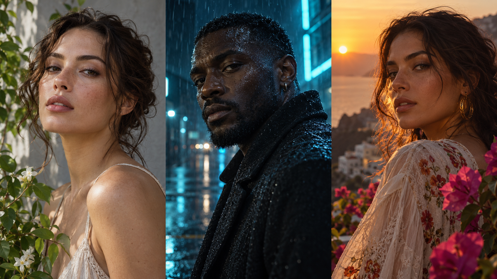
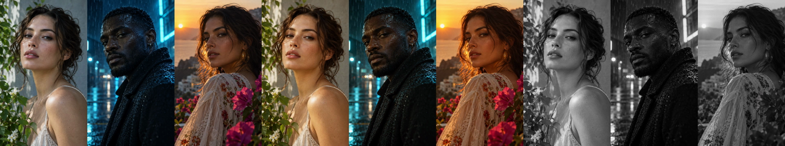
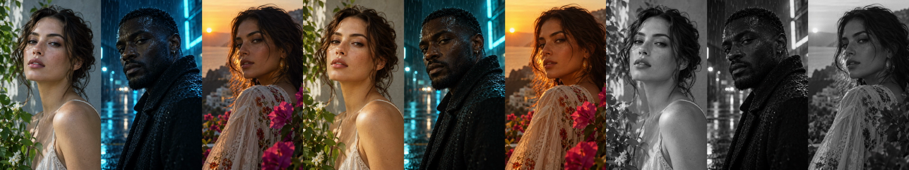

# Music Video render-grade validation

Issue: #9302. Synthetic visual review performed 2026-10-01.

## Reproduce

With Chrome and FFmpeg available, run:

```sh
PORTOS_GRADE_PROOF_DIR="$(mktemp -d)" npm test --prefix server -- --run services/musicVideo/documentRender.browser.test.js -t 'matches bounded grades'
```

The fixture creates RGB and grey ramps, encodes a lossless source clip, and
renders three timed looks through both the composed-footage graph and the real
sandboxed Chrome document capture: teal night, golden hour, monochrome. The
1280×720 document explicitly uses 12 fps, exercising a document rate different
from the 24 fps planning default. Every image and record is synthetic.

## Visual observations

Reference:


Composed output, left to right: teal night, golden hour, monochrome:


Document output at the same song times:


The grey ramp moves toward cool shadows in teal night and warm midtones in
golden hour; the monochrome section removes chroma. The same color bands stay
in the same palette across the two output paths. Fine grain is visible without
clipping black and white endpoints. Composed typography is downstream of the
grade; document text is captured before the grade, whose curves and tapered
grain preserve black and white for contrast. This is a controlled review of
actual encoded synthetic imagery, not a claim based only on filter strings.

Measured mean absolute RGB error (0–255 channel units): composed versus document
**1.47**; the document excerpt versus corresponding full-render frames **1.01**.
The 0.5–1.5 second excerpt crosses the look change at song second 1. Both
composed and document excerpts are bounded below 2 units of error against their
full renders. A repeated document excerpt decodes byte-for-byte identically,
including grain. Tolerances account for RGB/YUV conversion and independent H.264
prediction; encoded lossy frames are not claimed to be byte-identical between
architectures. The test also checks endpoint protection and monochrome chroma.

## Generated-shot visual acceptance

A separate test-only image set was explicitly commissioned for this acceptance
run using the imagegen tool on 2026-10-01. The three fictional portrait shots
cover light skin in neutral daylight, deep brown skin in cyan night lighting,
and olive skin at golden sunset. No live records, likeness references, or private
project assets were used. The source is committed so repeat validation runs make
zero provider calls.



The same reference set through teal night, golden hour, and monochrome, left to
right (each preset contains all three shots):





Controlled side-by-side inspection of these actual encoded contact sheets found
matching cool/warm palette shifts and monochrome conversion across both paths.
Daylight facial highlights remain distinct; the cyan-lit face retains readable
shadow detail and wet texture; sunset skin, hair rim light, fabric, foliage, and
flowers retain the same relationships in each path. Fine grain does not introduce
a visible palette or texture discontinuity. This validates render-time consistency
across representative generated imagery; it does not assert that grading makes
different original lighting conditions identical or that generation conditioning
itself produces consistent shots.

Measured RGB mean absolute error is **1.94/255** between paths, **2.03/255**
for document excerpt/full and **2.03/255** for composed excerpt/full. The repeated
document excerpt decodes byte-identically, including grain. The textured-image
test preserves the existing ramp's 2/255 excerpt bound and independently compares
an ungraded full/excerpt H.264 encode (**1.28/255**) to distinguish codec
prediction error from grade timing error. Both generated-shot excerpt errors are bounded below 3/255. The document
excerpt additionally must remain within 1/255 of its neutral document baseline.

Reproduce both fixtures with the command above. Optional proof exports now use
separate `ramps/` and `generated-shots/` directories, each with contact sheets
and exact metrics. The completed generated-shot check complements the existing
schema, persistence/clone, neutral bypass, overlay placement, cancellation, and
song-time excerpt checks delivered in PR #9358.
