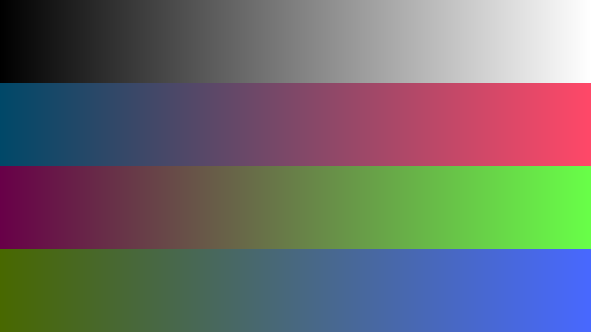
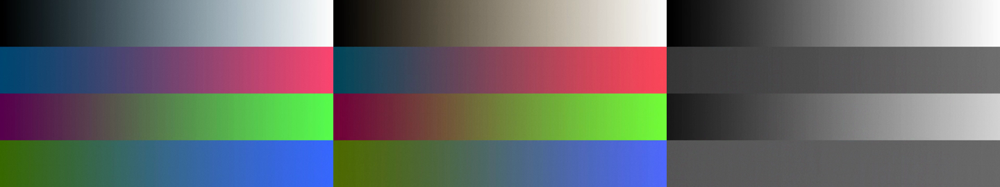
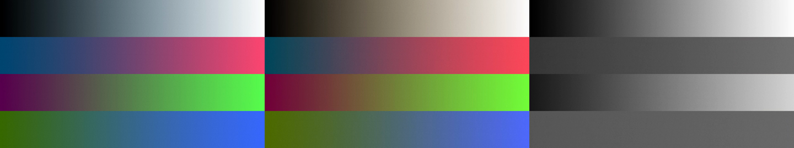

# Music Video render-grade validation

Issue: #9302. Synthetic visual review performed 2026-10-01.

## Reproduce

With Chrome and FFmpeg available, run:

```sh
PORTOS_GRADE_PROOF_DIR="$(mktemp -d)" npm test --prefix server -- --run services/musicVideo/documentRender.browser.test.js -t 'matches bounded grades'
```

The fixture creates RGB and grey ramps, encodes a lossless source clip, and
renders three timed looks through both the composed-footage graph and the real
sandboxed Chrome document capture: teal night, golden hour, monochrome. The
1280×720 document explicitly uses 12 fps, exercising a document rate different
from the 24 fps planning default. Every image and record is synthetic.

## Visual observations

Reference:



Composed output, left to right: teal night, golden hour, monochrome:



Document output at the same song times:



The grey ramp moves toward cool shadows in teal night and warm midtones in
golden hour; the monochrome section removes chroma. The same color bands stay
in the same palette across the two output paths. Fine grain is visible without
clipping black and white endpoints. Composed typography is downstream of the
grade; document text is captured before the grade, whose curves and tapered
grain preserve black and white for contrast. This is a controlled review of
actual encoded synthetic imagery, not a claim based only on filter strings.

Measured mean absolute RGB error (0–255 channel units): composed versus document
**1.47**; the document excerpt versus corresponding full-render frames **1.01**.
The 0.5–1.5 second excerpt crosses the look change at song second 1. Both
composed and document excerpts are bounded below 2 units of error against their
full renders. A repeated document excerpt decodes byte-for-byte identically,
including grain. Tolerances account for RGB/YUV conversion and independent H.264
prediction; encoded lossy frames are not claimed to be byte-identical between
architectures. The test also checks endpoint protection and monochrome chroma.

## Remaining acceptance

The reference sheet above does **not** establish palette/grain consistency on a
representative set of independently AI-generated shots, skin tones, and practical
lighting. That part of #9302 remains open: use an explicitly approved synthetic
or redistributable generated-shot set with reference images, render the selected
presets in both modes, and record a controlled side-by-side visual judgment.
No live project images were accessed and no generation-provider calls were made.
